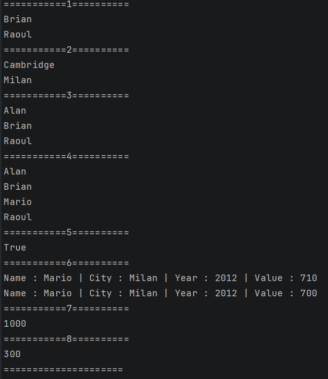

# Day 02 TIL

- 이름: `윤우상`
- 작성일: `2026-08-25`

## 1. 오늘 막힌 부분 또는 내린 판단

```

```

## 2. 수정 전과 수정 후

### 수정 전

```csharp
// <수정 전 코드를 작성하세요.>
    
```

### 수정 후

```csharp
// <수정 후 코드를 작성하세요.>

```

## 3. AI 사용 여부와 채택, 거절한 이유

- AI 사용 여부: `사용하지 않음`
- 질문: `<AI에게 한 질문>`
- 제안받은 내용: `<AI의 핵심 제안>`
- 채택 또는 거절한 내용: `<무엇을 선택했는지>`
- 판단한 이유: `<직접 검토한 근거>`

AI 대화 전문을 붙이지 말고 질문, 판단, 검증 내용을 요약합니다.

## 4. 검증 결과

- 빌드: `<성공>`
- 실행 결과: 
- 추가로 확인한 내용: 중복되는 값을 제거하기 위해 전체적으로 ToHashSet()을 사용하게됨

## 5. 아직 궁금한 점

```
1. C# 디버깅 과제 수행 중 
return nowTime.Hour switch
{
    >= 0 and < 2 => timeDataOne[0].Ty1,
    >= 2 and < 4 => timeDataOne[0].Ty2,
    >= 4 and < 6 => timeDataOne[0].Ty3,
    >= 6 and < 8 => timeDataOne[0].Ty4,
    >= 8 and < 10 => timeDataOne[0].Ty5,
    >= 10 and < 12 => timeDataOne[0].Ty6,
    >= 12 and < 14 => timeDataOne[0].Ty7,
    >= 14 and < 16 => timeDataOne[0].Ty8,
    >= 16 and < 18 => timeDataOne[0].Ty9,
    >= 18 and < 20 => timeDataOne[0].Ty10,
    >= 20 and < 22 => timeDataOne[0].Ty11,
    >= 22 and < 24 => timeDataOne[0].Ty12,
    _ => throw new ArgumentException("Time Exception")
};
라고 작성하는 C# 8.0 부터 추가되었다는 Switch 함수식이라는 방법에 대하여 알게 되었는데,
기존 문법보다 간편하게 사용할 수 있는것 같아 추가적인 사용 방법에 대하여 알고싶음.

2. 고계 함수 과제 진행 중에 Select, Where, Order by 같은 SQL에서 보이던 내용이 있어서 다양한 경우를 더 보고싶음.

```

## 6. 다음에 적용할 것

```
Switch 함수식 관련 내용을 사용할 기회가 있다면 추가적으로 사용해보기
 
```

