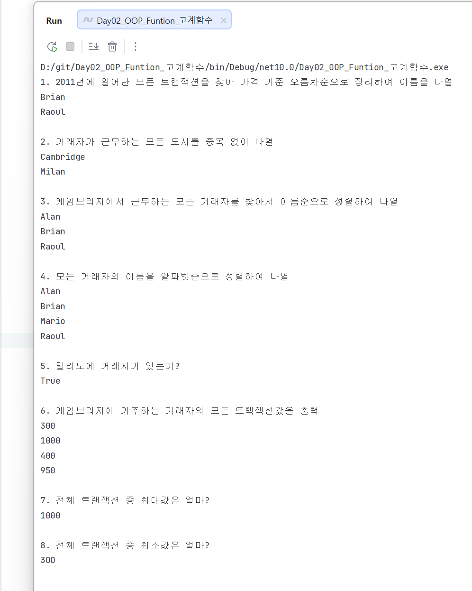

# Day 2 TIL

- 이름: `<진미>`
- 작성일: `<2026-08-25>`

## 1. 오늘 막힌 부분 또는 내린 판단

```<
전혀 감이 안 왔지만 친구들것을 훔쳐보면서 흐름으로 잡았습니다. 
대략 5번까지는 제가 했습니다 
>```

## 3. AI 사용 여부와 채택, 거절한 이유

- AI 사용 여부: `<사용하지 않음>`


## 4. 검증 결과

- 빌드: `<성공>`
- 실행 결과: `<이미지 참고>`



## 5. 배운 것

```<
 [ C# 의 LINQ에서 제공되는 고계 함수 ]
    Where: 조건 필터링
    Select: 데이터 변환
    Any: (조건 충족 여부 검사) 있는지 없는지 `true/false`
    All: 모든 요소가 조건을 만족하는지 확인 `true/false`
    Aggregate: 누적연산/ 하나가 될 때까지 줄이기
    ToList(): List 형태 변환
        ㄴ> ForEach: 전체 순환 >>>> List<T> 의 메서드! LINQ 함수는 아님        
    
    ToHashSet:** 중복제거 및 Set변환    
        ㄴ> Distinct: 중복 요소 제거
        ㄴ> ToHashSet() //💣⭐select와 세트(Distinct | ToHashSet)이므로 같이 사용
        

 
[ C# 줄임 함수 표현 방식 ]
 int Add(int a, int b) => a + b;
 즉, =>는 return을 의미
 
 
 
  NOTION(memo): https://app.notion.com/p/3c70010901598070b270d1ebf57fe782 
>```

