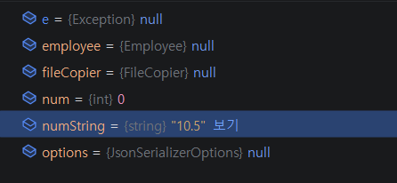
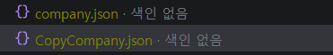
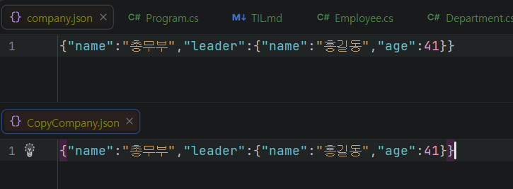

# Day 03 예외, 파일, 데이터 형식
- 이름: `윤우상`
- 작성일: `2026-08-31`

## 1. 오늘 막힌 부분 또는 내린 판단

- 직렬화를 완료하고, company.json에 저장하였을 때, 유니코드화 되어 인코딩 방식에 대하여 알아봄

## 2. 수정 전과 수정 후

### 수정 전

```csharp
// <수정 전 코드를 작성하세요.>
    
```

### 수정 후

```csharp
// <수정 후 코드를 작성하세요.>

```

## 3. AI 사용 여부와 채택, 거절한 이유

- AI 사용 여부: 사용
- 질문: 직렬화후 유니코드로 바뀐 한글을 인코딩하는 방법
- 제안받은 내용: options에서 JavaScriptEncoder 사용 제안
- 채택 또는 거절한 내용: 제안을 받고, 해당 내용을 [링크](https://learn.microsoft.com/ko-kr/dotnet/standard/serialization/system-text-json/character-encoding) 에서 확인하여 적용
- 판단한 이유: JavaScriptEncoder 활용 방법을 좀 더 알아보고 싶어서

AI 대화 전문을 붙이지 말고 질문, 판단, 검증 내용을 요약합니다.

## 4. 검증 결과

- 빌드: `<성공>`
- 실행 결과:   
- 추가로 확인한 내용: 중복되는 값을 제거하기 위해 전체적으로 ToHashSet()을 사용하게됨 -> 이후 리뷰로 Distinct() 존재를 알아 수정


## 5. 아직 궁금한 점

```
File.Copy("복사할 파일 주소", "복사본 저장할 주소")와 
File.WriteAllText("복사본 저장 주소", File.ReadAllText("복사할 파일 주소"))의 명확한 차이점
```

## 6. 다음에 적용할 것

```
Encoder = JavaScriptEncoder.Create(UnicodeRanges.All) 이런 방식으로 인코딩 하는 것을 이용한 파일 처리 방식
```

