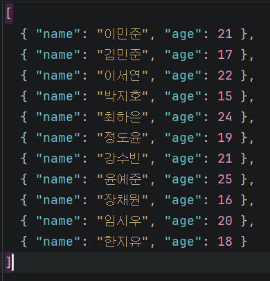
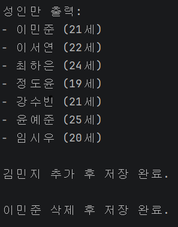
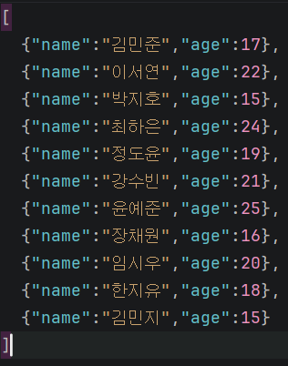

# Day 05 DataSource
- 이름: `윤우상`
- 작성일: `2026-09-07`

## 1. 오늘 막힌 부분 또는 내린 판단

- `People`클래스를 구성할 때 `Person`을 리스트로 받는 클래스로 만들기 위해 생각나는 방법이 없어서 해매다<br>
`List<Person>`을 저장하는 기능을 구현하면 된다고 판단하여 마무리함

## 2. 수정 전과 수정 후

### 수정 전

```csharp
// <수정 전 코드를 작성하세요.>
    public Person(string name, int age)
    {
        Name = name;
        Age = age;
    }
```

### 수정 후

```csharp
// <수정 후 코드를 작성하세요.>
    public Person(string name, int age)
    {
        Name = name;
        Age = age;
    }

    public Person()
    {
        Name = "";
        Age = 0;
    }
```

## 3. AI 사용 여부와 채택, 거절한 이유

- AI 사용 여부: 사용
- 질문: `Program.cs`의 34번 줄에서 생성자에 빨간 줄이 그이는 이유?
- 제안받은 내용: 생성자가 없기 때문이니 생성자를 만들어 해결하라.
- 채택 또는 거절한 내용: 위 방법을 통해 비어있는 생성자를 만들어 해결
- 판단한 이유: 기본값을 넣는 것으로 null값이나 쓰레기값이 들어가지 않도록 한다면
오류가 발생하지 않을것이라 판단하여 수정 및 해결함

AI 대화 전문을 붙이지 말고 질문, 판단, 검증 내용을 요약합니다.

## 4. 검증 결과

- 빌드: `<성공>`
- 실행 결과:  <br>  
- 추가로 확인한 내용: 


## 5. 아직 궁금한 점

```

```

## 6. 다음에 적용할 것

```
```

