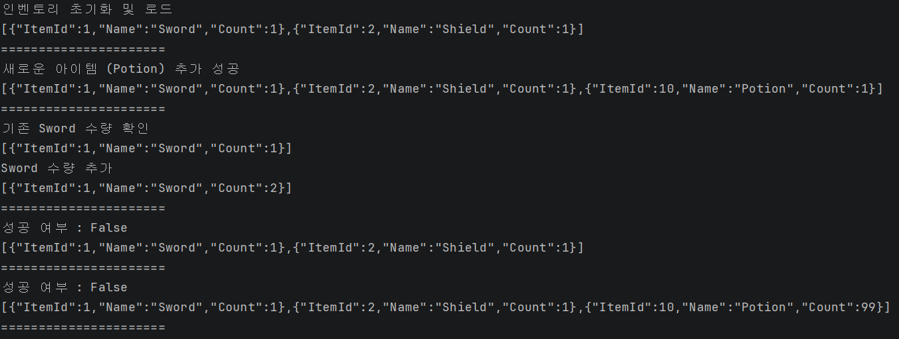

# Day 06 Model_Repository
- 이름: `윤우상`
- 작성일: `2026-09-08`

## 1. 오늘 막힌 부분 또는 내린 판단

- `InventoryRepository.cs`에서 아이템을 인벤토리에 추가하는 코드 작성 중에 `Contains()`를 이용하여 포함 여부를 검증하려다 실패
  - `Find()`를 사용하여 해결
- `MockItemDataSource.cs`를 작성할 때 인벤토리 정보를 저장하는 json 파일의 경로가 다른 경로로 되어있는 것을 확인하여 값을 받도록 <br>
`ItemDataSource.cs`에서 path 값을 받도록 수정하여 해결

## 2. 수정 전과 수정 후

### 수정 전

```csharp
// <수정 전 코드를 작성하세요.>
        List<Item> itemList = await Source.LoadAllItemsAsync();
        
        if (itemList.Contains(item) && item.Count <= MaxStack)
        {
            await Source.SaveAllItemsAsync(itemList);
            
            return true;
        }
        else if (!itemList.Contains(item) && itemList.Count < maxSlot && MaxStack - item.Count >= 0)
        {
            itemList.Add(item);
            await Source.SaveAllItemsAsync(itemList);
            return true;
        }
        return false;
```

### 수정 후

```csharp
// <수정 후 코드를 작성하세요.>
        List<Item> itemList = await Source.LoadAllItemsAsync();
        
        var findItem = itemList.Find(n => n.ItemId == item.ItemId);
        
        if (findItem != null && findItem.Count + item.Count <= MaxStack)
        {
            findItem.Count += item.Count;
            await Source.SaveAllItemsAsync(itemList);
            
            return true;
        }
        else if (findItem == null && itemList.Count < maxSlot && MaxStack - item.Count >= 0)
        {
            itemList.Add(item);
            await Source.SaveAllItemsAsync(itemList);
            return true;
        }
        return false;
```

## 3. AI 사용 여부와 채택, 거절한 이유

- AI 사용 여부: 사용
- 질문: 아이템이 이미 있는 상황임에도 같은 아이템을 추가하니 새로운 아이템 칸을 늘려서 추가하는데 이유가 뭐냐
- 제안받은 내용: 같은 객체인지 검사하는 코드라 그렇기 때문임
- 채택 또는 거절한 내용: 해당 내용 확인 후 Find를 활용해 해결하는 방향으로 작업 진행
- 판단한 이유: 

AI 대화 전문을 붙이지 말고 질문, 판단, 검증 내용을 요약합니다.

## 4. 검증 결과

- 빌드: `<성공>`
- 실행 결과:  <br>
- 추가로 확인한 내용: 


## 5. 아직 궁금한 점

```
Contains 해결 방법 중 현재의 Find로 찾는 방법 말고도 Eqauls를 오버라이드 하여 작업할 수 있었는데, 더 나은 방법이 무엇이었을지
```

## 6. 다음에 적용할 것

```

```

