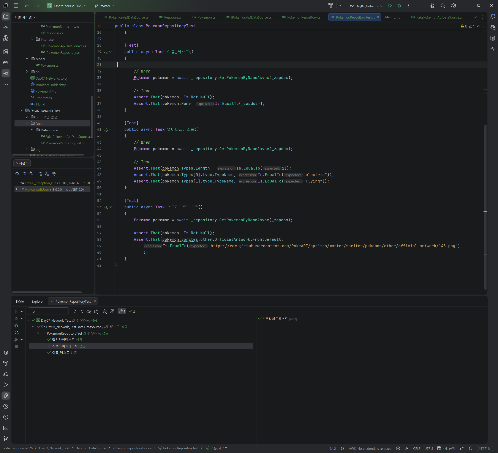

# Day 07 Network
- 이름: `윤우상`
- 작성일: `2026-09-14`

## 1. 오늘 막힌 부분 또는 내린 판단

- 테스트 코드 작성에 어려움을 느껴 AI 도움으로 방향을 제시받음

## 2. 수정 전과 수정 후

### 수정 전

```csharp
// <수정 전 코드를 작성하세요.>

```

### 수정 후

```csharp
// <수정 후 코드를 작성하세요.>

```

## 3. AI 사용 여부와 채택, 거절한 이유

- AI 사용 여부: 사용
- 질문: 테스트 코드 작성하려는데, 실제 api로 받아온 내용을 어떻게 테스트로 연결해야할 지 모르겠다
- 제안받은 내용: 테스트 코드 작성시 실제 api로 받아온 내용이 아닌 가상의 답변을 만들어 그것으로 테스트를 해봐라
- 채택 또는 거절한 내용: 답변대로 Api로 받아온 내용의 일부를 복사하여 Day07_Network_Test 에서의 FakePokemonApiDataSource.cs 작성
- 판단한 이유: 테스트 코드를 작성하기 위하여

AI 대화 전문을 붙이지 말고 질문, 판단, 검증 내용을 요약합니다.

## 4. 검증 결과

- 빌드: `<성공>`
- 실행 결과:  
- 추가로 확인한 내용: 


## 5. 아직 궁금한 점

- 현재 임의로 만든 API로만 테스트하였는데, 실제 API를 이용한 검증 방식이 무엇이고, 차이가 있는지.
- 실제 API를 받아올때, 임의의 값으로 테스트하는게 가능할지

## 6. 다음에 적용할 것

- 실제 API를 이용하여 검증하는 방식에 대해 학습한 후 시도해보기

