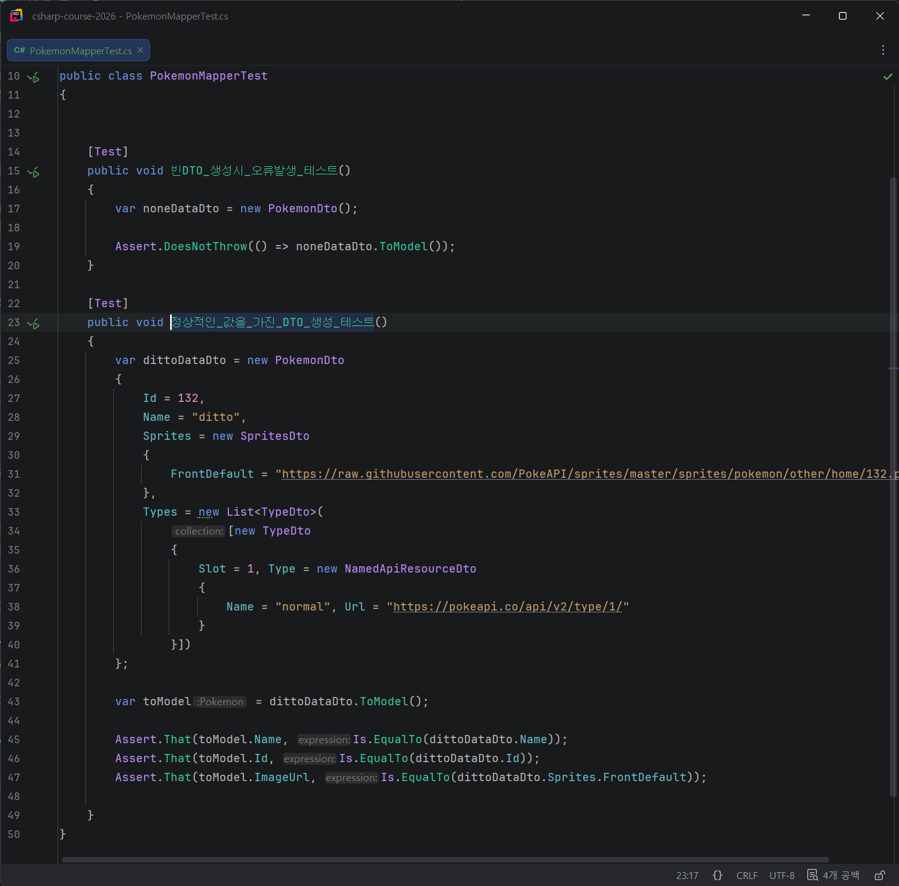
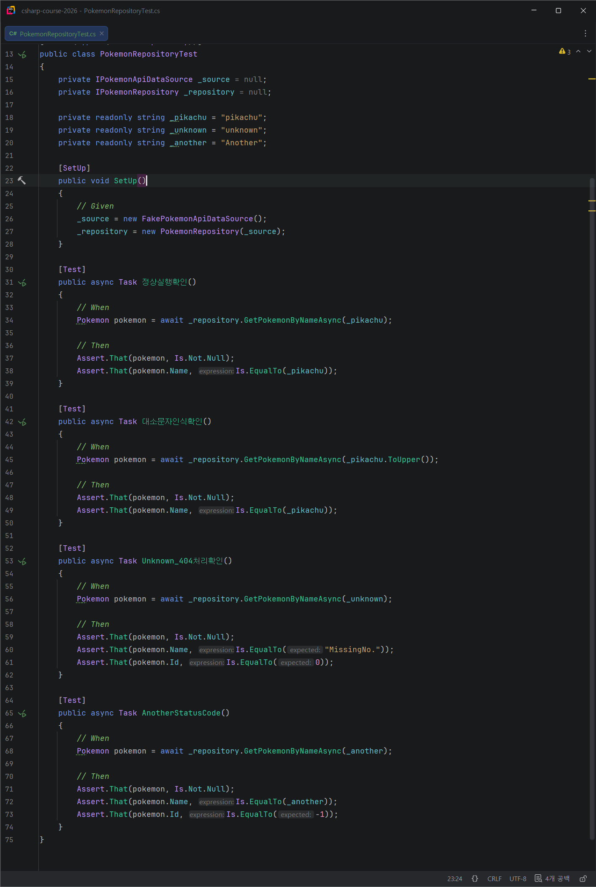
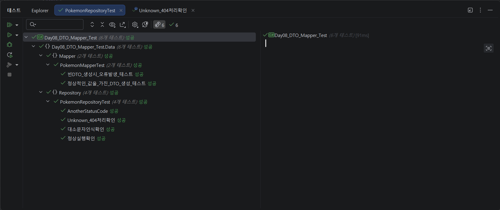

# Day 08 DTO Mapper
- 이름: `윤우상`
- 작성일: `2026-09-15`

## 1. 오늘 막힌 부분 또는 내린 판단

- Pokemon을 구성해서 출력하려는데, Type이 배열로 출력되어 ToString()을 오버라이드하여 수정함.


## 2. 수정 전과 수정 후

### 수정 전

```csharp
// <수정 전 코드를 작성하세요.>

```

### 수정 후

```csharp
// <수정 후 코드를 작성하세요.>

```

## 3. AI 사용 여부와 채택, 거절한 이유

- AI 사용 여부: 사용
- 질문: Mapper 테스트 코드 시나리오 작성
- 제안받은 내용: 비어있는 DTO, 정상값을 가진 DTO 각각 생성하여 테스트
- 채택 또는 거절한 내용: 

AI 대화 전문을 붙이지 말고 질문, 판단, 검증 내용을 요약합니다.

## 4. 검증 결과

- 빌드: `<성공>`
- 실행 결과:  <br> 
- 추가로 확인한 내용: 


## 5. 아직 궁금한 점

- 

## 6. 다음에 적용할 것

- 

