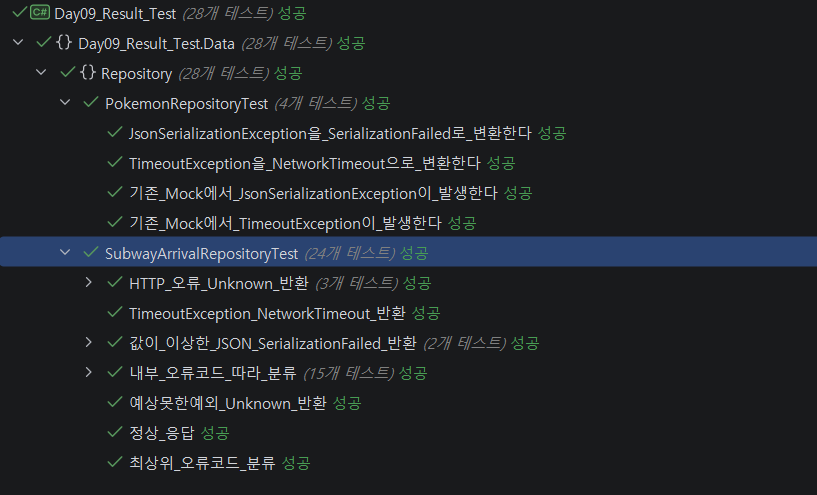

# Day 09 Result
- 이름: `윤우상`
- 작성일: `2026-09-21`

## 1. 오늘 막힌 부분 또는 내린 판단

- 실제 지하철 공공API에서 오류가 발생하여도 HTTP 200 코드가 반환됨
  - 내부 메시지나 오류메시지 안의 `Code`내용을 토대로 API 가이드라인에 맞는 에러를 구분하도록 수정


## 2. 수정 전과 수정 후

### 수정 전

```csharp
// <수정 전 코드를 작성하세요.>
switch (subDto.ErrorMessage?.Code ?? "Unknown")

dto.RealtimeArrivalList?[0].StatnNm ?? "역이름 없음"

```

### 수정 후

```csharp
// <수정 후 코드를 작성하세요.>
[JsonPropertyName("code")]
public string? Code { get; set; }
/*---------위는 DTO 수정--------*/
switch (subDto.ErrorMessage?.Code ?? subDto.Code ?? "Unknown")

dto.RealtimeArrivalList?.FirstOrDefault()?.StatnNm ?? "역이름 없음"
```

## 3. AI 사용 여부와 채택, 거절한 이유

- AI 사용 여부: 사용
- 질문: Repository 테스트 코드 작성 방법, 실제 테스트 중 기존과 다른 Json 형식이 오는 경우 해결방안
- 제안받은 내용: 
  - 가상의 API 응답과 예외를 만들어 테스트
  - `errorMessage`와 `realtimeArrivalList`가 정상적으로 있거나 둘 다 없이 오는 경우를 대비하여<br>DTO를 수정하여 오류코드의 위치가 달라도 분류할 수 있도록 수정
- 채택 또는 거절한 내용: 

AI 대화 전문을 붙이지 말고 질문, 판단, 검증 내용을 요약합니다.

## 4. 검증 결과

- 빌드: `<성공>`
- 실행 결과:  <br>
- 추가로 확인한 내용: HTTP 200임에도 오류 코드에 따라 Failure가 반환되는지 확인


## 5. 아직 궁금한 점

- 다른 값들은 정상값으로 들어오는데, 일부 값이 없거나 잘못된 값이 오는 경우를 구분하는 법

## 6. 다음에 적용할 것

- 

